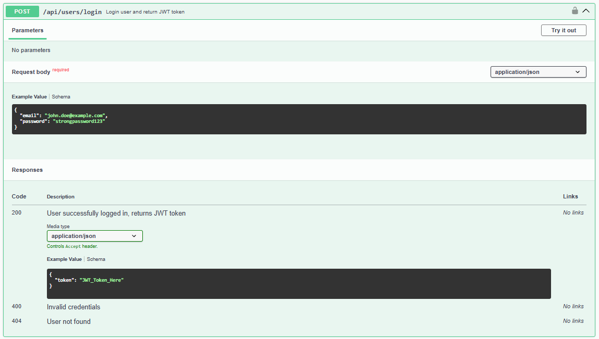
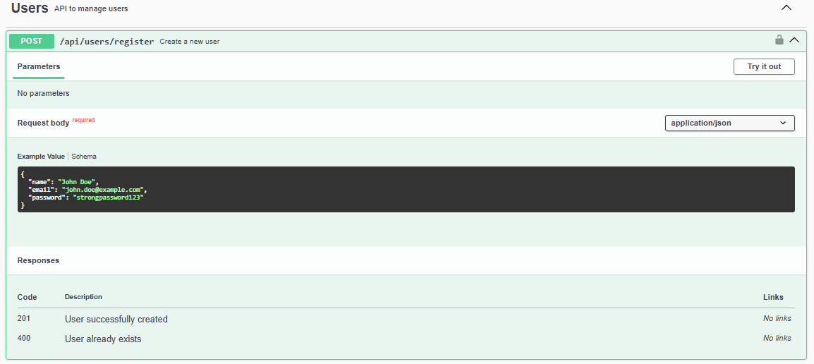
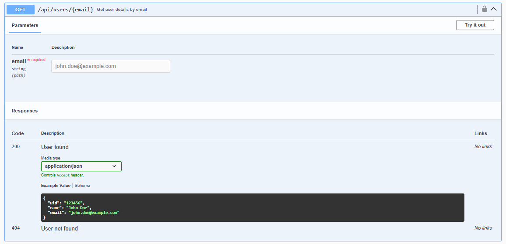
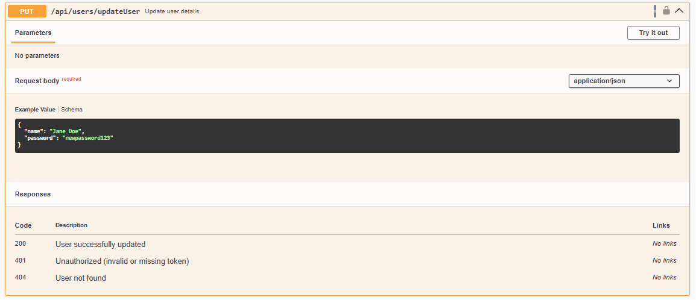
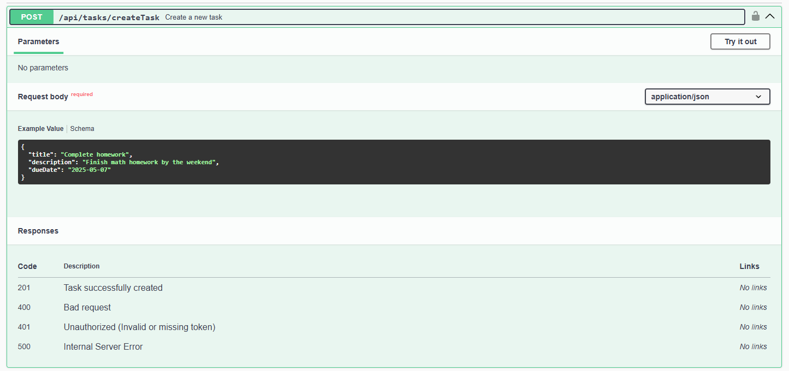
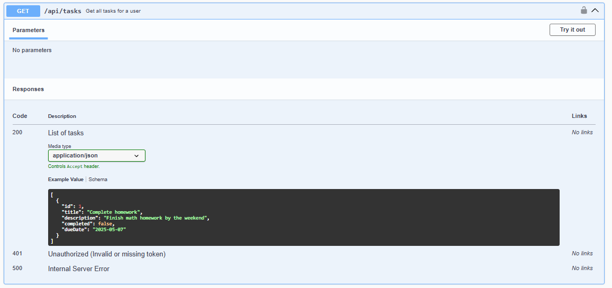
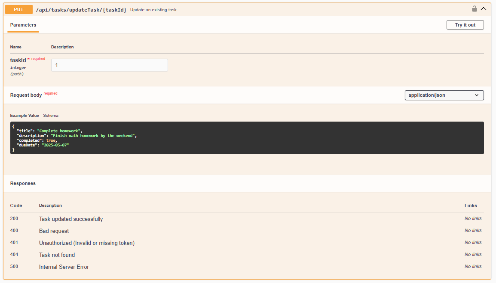
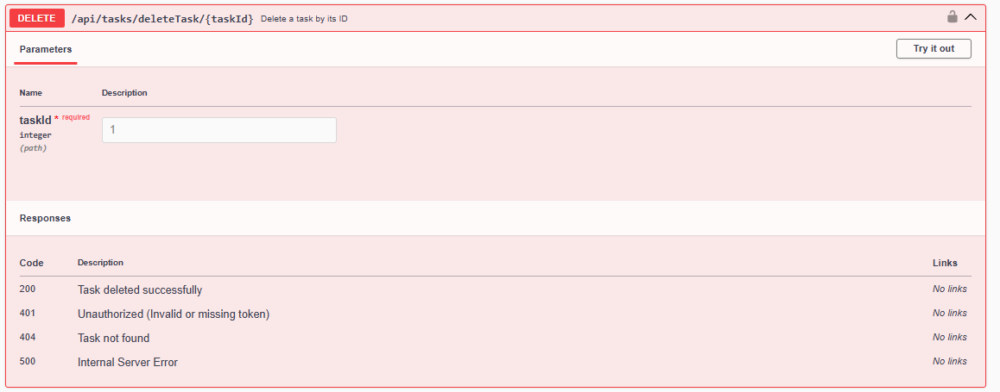
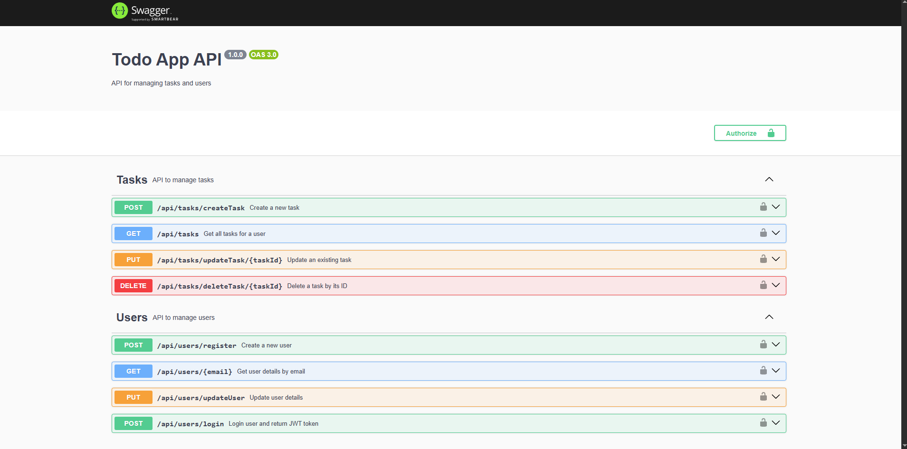

# wads-todolist-sequelize
WADS Week 8 Assignment 

# API Documentation
The API is fully documented using Swagger. You can access the Swagger UI at /api-docs when the server is running.
## Authentication

Login endpoint for user authentication

Register endpoint for creating new user accounts
## Users

Endpoint to retrieve user information

Endpoint to update user profile information
## Tasks

Endpoint to create a new task

Endpoint to retrieve task information

Endpoint to update task details

Endpoint to delete a task
## API Endpoints
Swagger Documentation

Complete API documentation with Swagger UI
